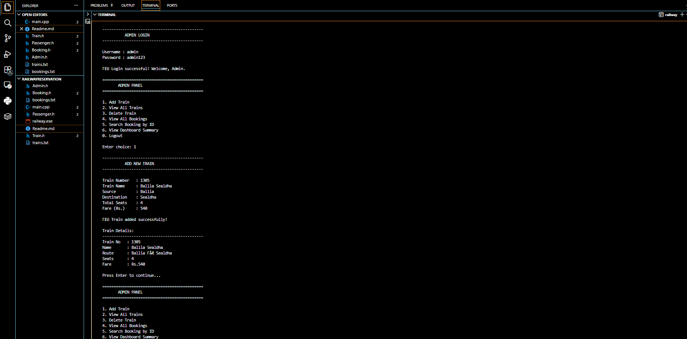
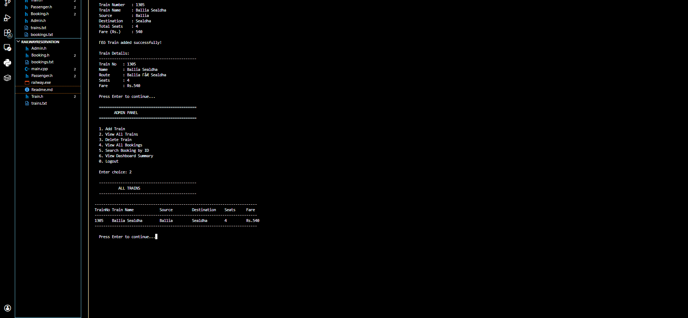
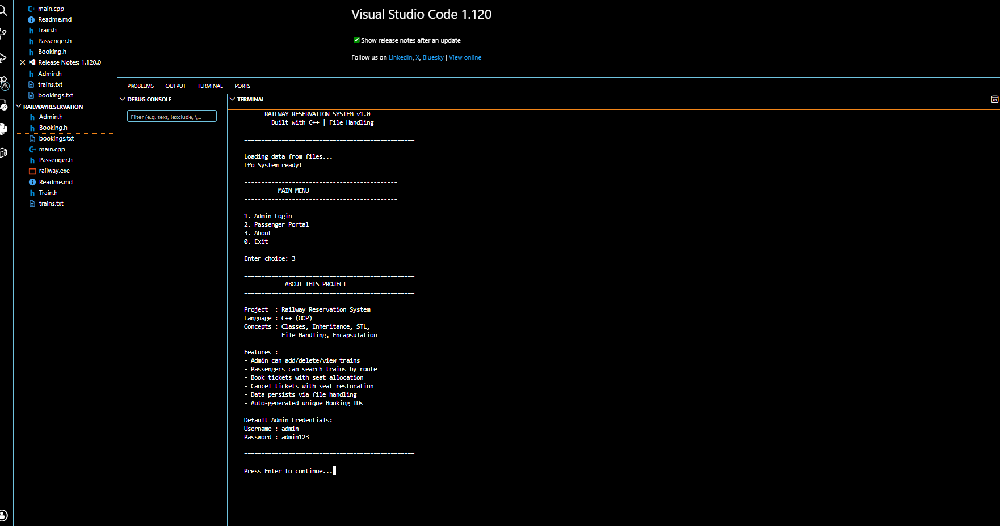

# 🚂 Railway Reservation System
> A console-based Railway Reservation System built in C++ using Object-Oriented Programming principles.

---

## 📌 Features

### Admin Panel
- Secure login (3 attempts)
- Add / Delete / View trains
- View all bookings system-wide
- Search booking by ID
- Dashboard summary

### Passenger Portal
- Search trains by source & destination
- Book tickets with auto seat allocation
- View booking history by name
- Cancel ticket with seat restoration
- Print e-ticket in terminal

### Technical Features
- Data persists via **File Handling** (trains.txt, bookings.txt)
- Auto-generated unique Booking IDs (BK1001, BK1002...)
- Input validation throughout
- Works on Windows & Linux

---

## 🛠️ Tech Stack

| Component | Technology |
|---|---|
| Language | C++ (C++17) |
| Paradigm | Object Oriented Programming |
| Storage | File Handling (.txt files) |
| STL Used | vector, string |
| Compiler | g++ / MinGW |

---

## 📁 Project Structure

```
RailwayReservation/
├── main.cpp          ← Entry point, main menu
├── Train.h           ← Train & TrainManager classes
├── Booking.h         ← Booking & BookingManager classes
├── Admin.h           ← Admin module
├── Passenger.h       ← Passenger module
├── trains.txt        ← Auto-generated: train data
├── bookings.txt      ← Auto-generated: booking data
└── README.md
```

---

## ▶️ How to Run

### Windows
```bash
g++ -o railway main.cpp -std=c++17
railway.exe
```

### Linux / Mac
```bash
g++ -o railway main.cpp -std=c++17
./railway
```

---

## 🔐 Default Admin Credentials

```
Username : admin
Password : admin123
```

---

## 🎯 OOP Concepts Used

| Concept | Where Used |
|---|---|
| **Classes & Objects** | Train, Booking, Admin, Passenger |
| **Encapsulation** | Private data with public getters/setters |
| **Abstraction** | Manager classes hide file I/O complexity |
| **STL** | vector<Train>, vector<Booking> |
| **File Handling** | ofstream/ifstream for persistent storage |
| **Destructors** | Auto-save on program exit |
| **Pointers** | findTrain(), findBooking() return pointers |

---

## 📸 Sample Output

```
==================================================
     RAILWAY RESERVATION SYSTEM v1.0
       Built with C++ | File Handling
==================================================

  INDIAN RAILWAY - E-TICKET
  ==================================================
  Booking ID   : BK1001
  Status       : CONFIRMED
  Train Name   : Rajdhani Express
  From         : Mumbai
  To           : Delhi
  Passenger    : Rahul Singh
  Seat No      : 1
  Fare Paid    : Rs.500.00
  ==================================================
```

---
---

## 📸 Screenshots

### 🏠 Main Menu


### 🔐 Admin Login & Add Train


### 🚆 View Trains


---

## 👨‍💻 Author
Built as a C++ OOP project .